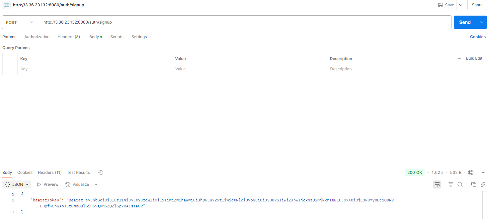
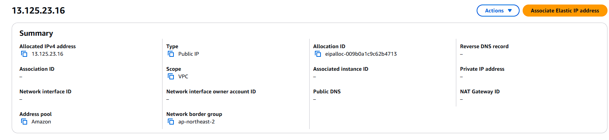
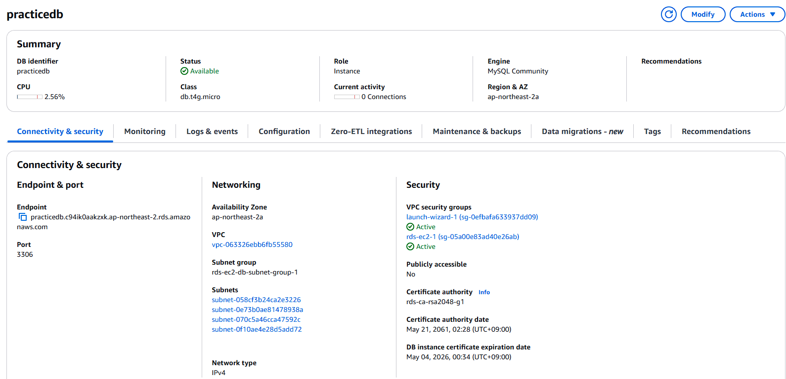
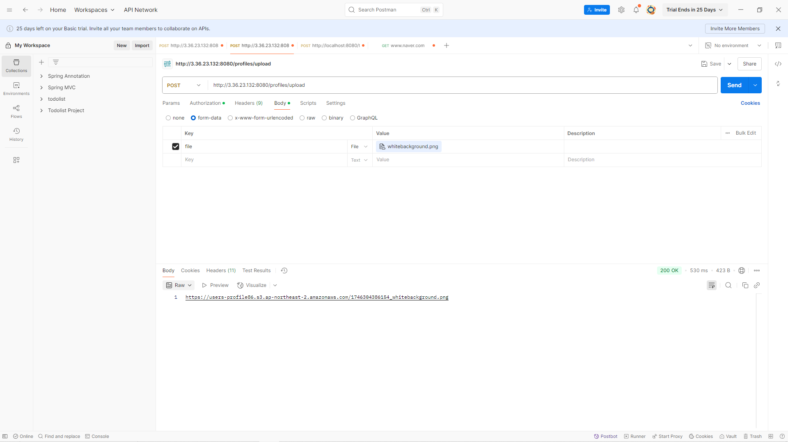
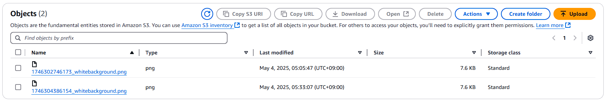

# SPRING PLUS

---

## AWS Practice

### 1. EC2
The application is deployed and running on an AWS EC2 instance.
A static (elastic) IP has been assigned for external access.
I could access the server's health status through the endpoint.


I could successfully access on the URL as the capture above.

---

.png)
#### `EC2 Details Setting`

---

.png)

#### `EC2 Security Setting`

---



#### `EC2 Elastic IP Setting`

---

### 2. RDS
An Amazon RDS (MySQL) database instance was created.
The application running on EC2 connects to the RDS instance to store and retrieve data.


The data is stored on RDS as the capture above.

---


#### `RDS Setting`

---

### 3. S3

An Amazon S3 bucket was created to store user profile images.
The backend provides an API to upload and manage profile images.



I can see that image is successfully stored on the bucket.

---


#### `S3 Setting`

---

## Large Data Processing: Efficient User Lookup by Nickname

On this experiment, I aimed to find more efficient way to search for users by nickname using JPA when handling a large dataset.

---

To simulate a real-world, large-scale environment, I generated 1,000,000 User records with unique nicknames using UUID. While importing this data, I had to increase Intellij's heap size, as the default setting led to memory crashes.

This is the initial code I used:

```java
    public UserResponse getUserByNickname(String nickname) {

        return userRepository.findByNickname(nickname)
            .orElseThrow(()-> new InvalidRequestException("user Not Found"));
    }
```
`UserService.java`
```java
	Optional<UserResponse> findByNickname(String nickname);
```
---
`UserRepository.java`

Test code to measure performance:
```Java
    @Test
	void testFindByNicknamePerformance() {
		List<Long> list = new ArrayList<>();
		for(int i = 0 ; i < 100; i++){

			long start = System.currentTimeMillis();
			UserResponse response = userService.getUserByNickname(targetNickname);
			long end = System.currentTimeMillis();

			System.out.println("닉네임 조회 시간(ms): " + (end - start));
			Assertions.assertNotNull(response);
			list.add(end-start);
		}

		Long sum = 0L;
		for(long num : list){
			sum += num;
		}
		System.out.println("닉네임 평균 조회 시간(ms): " + sum/list.size());
	}
```
This is the way how I count the time.

The result of this common JPA code shows like this:


Instead of fetching the entire entity, I used a JPQL projection to only select the necessary fields(id, email).
```java
@Query("SELECT new org.example.expert.domain.user.dto.response.UserResponse(u.id, u.email)"
		+ " FROM User u WHERE u.nickname = :nickname")
	Optional<UserResponse> findByNickname(String nickname);
```
`UserRepoistory.java`

The result of this JPQL Projection code shows like this:


This time, I added a DB index to the `nickname` column to spped up the queyr at the database level.
```java
@Table(name = "users", indexes = {
    @Index(name = "idx_nickname", columnList = "nickname")
})
public class User extends Timestamped { }
```
The result of this index shows like this:

It shows dramatically big changes.

When I used both optimizations, it turned out like this:


### Conclusion
| Method             | Performance |TIME|
| ------------------ | ----------- |----|
| Default JPA        | Slow        |481ms|
| JPQL Projection    | Faster      |431ms|
| With Index         | Much Faster |3ms|
| Projection + Index | Fastest     |2ms|

Through this test, I learned the importance of query optimization and indexing in large-scale systems.

With over 1 million records, even a small c hange i n how data is fetched can make a huge difference in performance.